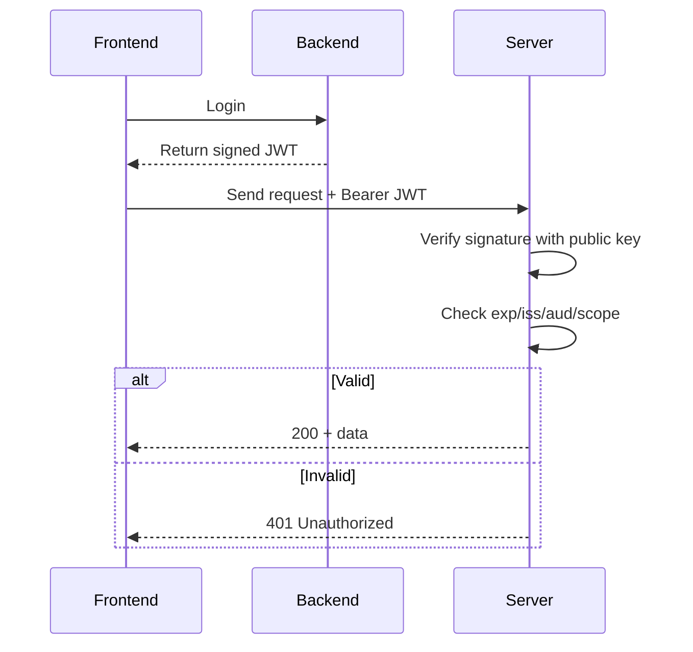
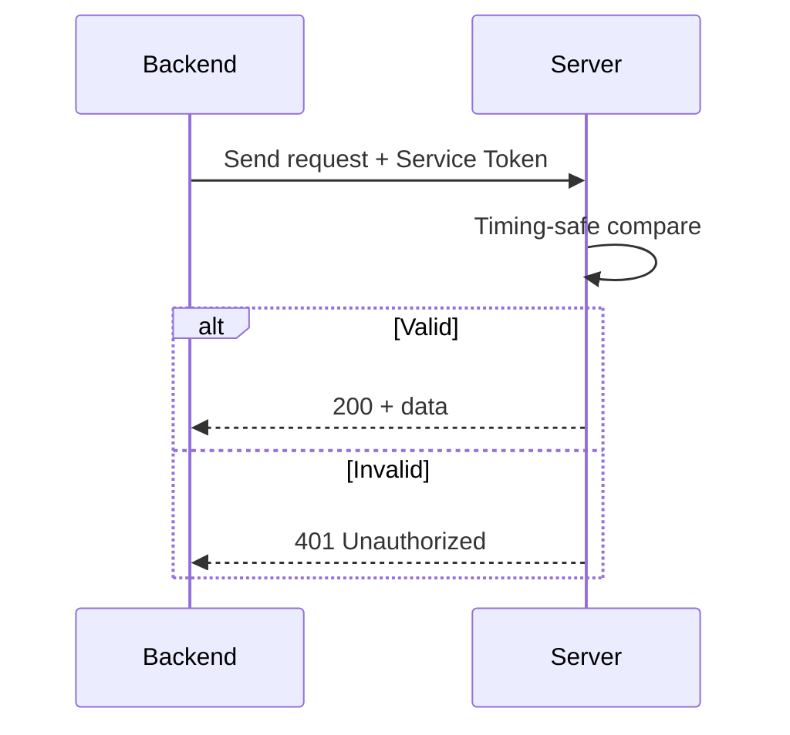

# Security for Server - Frontend - Backend Communication

This document describes the methods, operational mechanisms, and digital signature details for requests from Frontend to Server and from Backend to Server.

## 1) Frontend -> Server (Bearer Access Token)

### Purpose
- Ensure only authenticated users can access Server APIs.
- Prevent public access to sensor data, metrics, and control logs.

### Method
- Frontend attaches the access token issued by Backend in the HTTP header.
- Header format: `Authorization: Bearer <access_token>`.

### How It Works
- Backend issues a JWT after successful login.
- The JWT is digitally signed using the authentication system's private key.
- Frontend temporarily stores the token and attaches it to every request sent to Server.
- Server validates the JWT signature using the corresponding public key.
- If the signature is valid, Server also checks constraints:
  - Expiration (`exp`) and issued-at (`iat`).
  - Issuer (`iss`) and audience (`aud`) if configured.
  - Scopes/permissions if present in the token.

### Digital Signature Mechanism (JWT)
- Signed data: `base64url(header) + '.' + base64url(payload)`.
- Typical algorithm: RS256 (RSA + SHA-256).
- Private key is held only by Backend (Passport) to sign tokens.
- Public key is loaded by Server to verify signatures.
- If the signature is invalid or the token is modified, Server rejects the request.

### Sequence Diagram

### Related Configuration
- Public key loaded by Server from environment:
  - `server/.env`: `JWT_PUBLIC_KEY_PATH=../backend/storage/oauth-public.key`

### Endpoints Requiring Bearer Token
- `GET /v1/metrics`
- `GET /v1/metrics/nodes`
- `GET /v1/sensors/query`
- `GET /v1/control-acks/overview`
- `GET /v1/control-acks/query`

### Responses
- `401 Unauthorized`: missing or invalid token.
- `500 Internal Server Error`: public key could not be loaded.

---

## 2) Backend -> Server (Service Token)

### Purpose
- Protect internal service-to-service calls from request spoofing.
- RBAC is handled by Backend; Server only validates the service token.

### Method
- Backend sends a shared token in the header.
- Header format:
  - `Authorization: Bearer <SERVICE_TOKEN>` or
  - `X-Service-Token: <SERVICE_TOKEN>`

### How It Works
- Backend reads `SERVICE_TOKEN` from config and attaches it to the request.
- Server reads the token from headers and compares using a timing-safe method.
- If the token matches, the request is accepted; otherwise, it returns 401.

### Digital Signature Mechanism (Optional Upgrade)
- Current Service Token is a shared secret and has no digital signature.
- For higher security, this can be upgraded to signed JWT for Backend:
  - Backend signs JWT with a private key.
  - Server verifies with the corresponding public key.
  - Add `aud` and `exp` to reduce exposure if the token leaks.

### Sequence Diagram

### Configuration
- Backend: `backend/.env`
  - `NODE_SERVER_SERVICE_TOKEN=<shared-token>`
- Server: `server/.env`
  - `SERVICE_TOKEN=<shared-token>`

### Endpoints Requiring Service Token
- `/v1/control/*`
- `/v1/device-status`
- `/v1/whitelist`

### Responses
- `401 Unauthorized`: missing or invalid token.
- `500 Internal Server Error`: SERVICE_TOKEN is not configured on Server.

---

## Deployment Notes
- Server accepts both Bearer JWT (from Frontend) and Service Token (from Backend).
- If a Bearer token is present, Server tries JWT verification first; if invalid, it falls back to Service Token.
- RBAC is enforced by Backend; Server only validates token authenticity.
